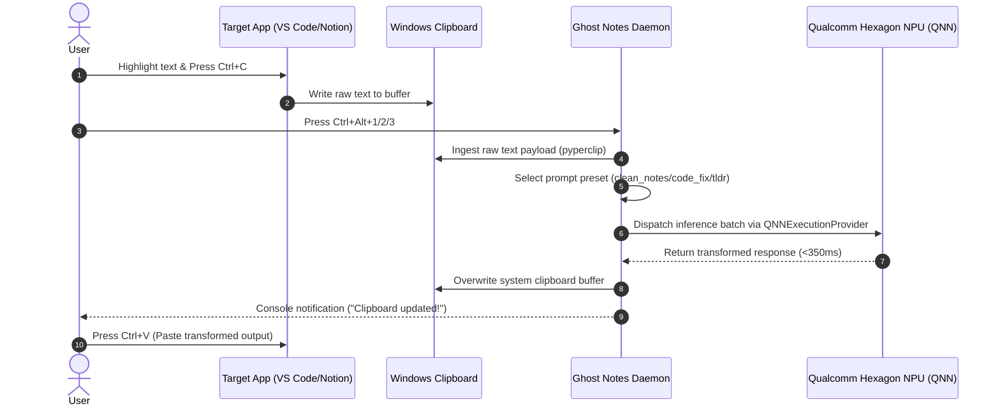

# Ghost Notes: System Design & Architectural Blueprint

**Ghost Notes** utilizes an event-driven Producer-Consumer pattern. The global keyboard listener acts as an event generator, piping content through a thread-safe inference queue to prevent race conditions and ensure sub-second response times.

---

## Architecture Diagram

```
+-----------------------------------------------------------------------------------+
|                            USER WORKFLOW / APPLICATION                            |
|             (VS Code / Notion / Terminal / MS Word / PDF Viewer / Browser)        |
+-----------------------------------------------------------------------------------+
                                         │
                    [Press Ctrl+Alt+1 / Ctrl+Alt+2 / Ctrl+Alt+3]
                                         │
                                         ▼
+-----------------------------------------------------------------------------------+
|                        GHOST NOTES DAEMON (HOST: WINDOWS ON ARM)                  |
|                                                                                   |
|  +---------------------------+             +----------------------------------+   |
|  |   Global Hotkey Listener  | ──────────> |   Clipboard Manager (pyperclip)  |   |
|  |   (keyboard / pynput)     |             |   - Reads active clipboard buffer   |   |
|  +---------------------------+             +----------------------------------+   |
|                │                                            │                     |
|                ▼                                            ▼                     |
|  +----------------------------------------------------------------------------+   |
|  |                         Prompt Preset Dispatcher                           |   |
|  |  Modes: [1] Clean Markdown  |  [2] Code Refactoring  |  [3] Executive TL;DR  |   |
|  +----------------------------------------------------------------------------+   |
+----------------------------------------│------------------------------------------+
                                         │
                                         ▼
+-----------------------------------------------------------------------------------+
|                        QUALCOMM AI ACCELERATION PIPELINE                          |
|                                                                                   |
|  +-----------------------------------------------------------------------------+  |
|  |     ONNX Runtime Engine (onnxruntime-genai / onnxruntime-arm64)             |  |
|  |     Execution Provider: QNNExecutionProvider (QnnHtp.dll on Hexagon NPU)   |  |
|  +-----------------------------------------------------------------------------+  |
|                                        │                                          |
|                                        ▼                                          |
|  +-----------------------------------------------------------------------------+  |
|  |     Compiled Qualcomm AI Hub Model: Llama-3.2-1B-Instruct (INT4 / W8A16)     |  |
|  |     Target Hardware: Qualcomm® Hexagon™ NPU (Snapdragon X Elite / Plus)       |  |
|  +-----------------------------------------------------------------------------+  |
+----------------------------------------│------------------------------------------+
                                         │ (Formatted Output)
                                         ▼
+-----------------------------------------------------------------------------------+
|  1. Re-write transformed string into Windows OS clipboard                         |
|  2. User presses [Ctrl + V] in any target application                              |
+-----------------------------------------------------------------------------------+
```

---

## Data Flow Pipeline (Mermaid)



---

## Key Architectural Components

### 1. Event Listener & Dispatcher (`ghost_notes/daemon.py`)
- Listens for global OS keyboard events non-blockingly using `keyboard`.
- Acquires `threading.Lock()` to prevent race conditions during rapid hotkey execution.

### 2. Prompt Preset Engine (`ghost_notes/presets.py`)
- Injects strict prompt formatting templates around intercepted clipboard text.
- Forces output models (Llama-3.2-1B / Phi-3.5) to omit conversational headers ("Here is your text:") and output cleanly structured Markdown.

### 3. Qualcomm AI Hardware Acceleration (`ghost_notes/npu_engine.py`)
- Configures ONNX Runtime with `QNNExecutionProvider`.
- Targets `QnnHtp.dll` with `htp_performance_mode: burst` for maximum TOPS utilization on Qualcomm Hexagon NPU.
- Includes automatic zero-overhead CPU simulation fallback when running outside ARM Snapdragon hardware.
